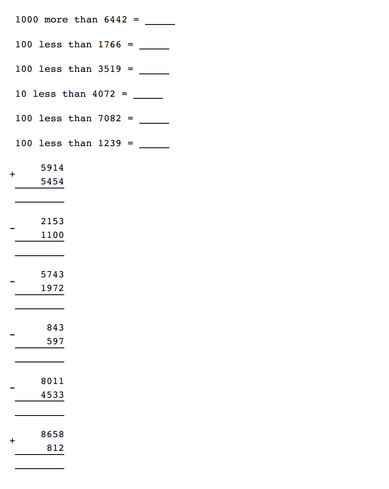

# sum-generator

A Ruby script to generate an HTML document containing simple maths problems. They look like this:

## Usage

    ruby generate.rb > out.html

There are a bunch of parameters that can be controlled by tweaking numbers at the bottom of the script.